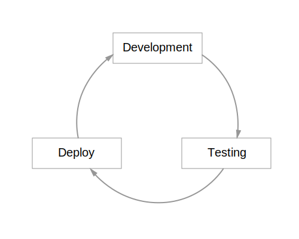
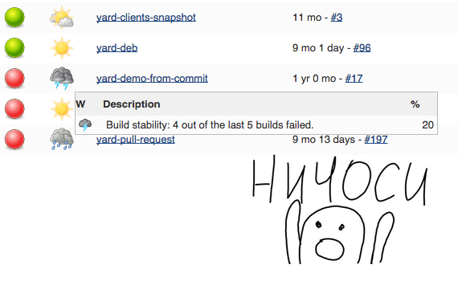
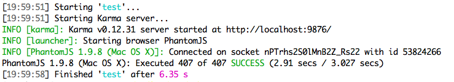
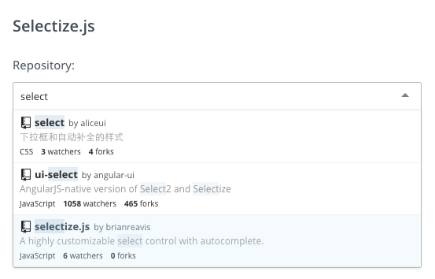

---

layout: default

title: Making tests faster
style: |
    #cover {
        background: #fff;
    }

    .center {
        text-align: center;
    }

    .side-meme {
        position: absolute;
        right: 0;
        bottom: 0;
    }

    .slide h3 {
        float: none;
        margin-bottom: 1em;
    }

---

# {{ page.title }} {#cover}

    
{{ site.author.name }},   {{ site.author.position }}

## In early develoment

{:.center}

{:.side-meme}

## And then

{:.center}

## But it could be

{:.center}

{:.center}

400 tests has passed just in 3 seconds
{:.center}

## Event without tests in parallel!

{:.center}

## Test some component!

{:.center}

## Our tech stack

{:.center}

## Test anatomy

    it("test", function() {
        //setup
        //exersise
        //verify
        //teardown
    });

## This is how nice setup looks

{:.center}

## Setup

    beforeEach(function () {
        this.element = $("<select></select>")
            .appendTo('body')
            .selectize({});
    });

## Setup-fixed

    beforeEach(function () {
        this.<mark>wrapper</mark> = $('

');
        this.element = $("<select></select>")
            .appendTo(<mark>wrapper</mark>)
            .selectize({});
    });

## Test case

    it("should open dropdown on click", function (done) {
        var self = this;
        this.element.find('.selectize-input').trigger('click');
        <mark>window.setTimeout</mark>(function () {
            expect(self.element.find('.selectize-dropdown').css('display')).not.toBe('none');
            expect(self.element.find('.selectize-dropdown [data-selectable]').length).toBe(2);
            done();
        }, 1);
    });

## Get rid of setTimeout

    it("should open dropdown on click", function () {
        this.element.find('.selectize-input').trigger('click');
        <mark>jasmine.clock().tick(1);</mark>

        expect(this.element.find('.selectize-dropdown').css('display')).not.toBe('none');
        expect(this.element.find('.selectize-dropdown [data-selectable]').length).toBe(2);
    });

## jasmine.clock

    jasmine.clock.install = function() {
        //replace timeout to fake
        realSetTimeout = global.setTimeout;
        global.setTimeout = fakeTimeout;

        //current date can be emulated too
        GlobalDate = global.Date;
        global.Date = FakeDate;
    };

## jasmine.clock

    jasmine.clock.tick = function(ms) {
        //increase current date
        mockDate.tick(ms);
        //call registered timeouts
        delayedFunctionScheduler.tick(ms);
    };

jasmine.clock – rewind boring things!

## PageObjects

    function SelectizeElement(element) {
        this.element = element;
    }
    SelectizeElement.prototype.<mark>control</mark> = function() {
        return this.element.querySelector('.selectize-input');
    }
    SelectizeElement.prototype.<mark>dropdown</mark> = function() {
        return this.element.querySelector('.selectize-dropdown');
    }

## Back to our test

    it("should open dropdown on click", function () {
        this.element.find(<mark>'.selectize-input'</mark>).trigger('click');
        jasmine.clock().tick(1);

        expect(this.element.find(<mark>'.selectize-dropdown'</mark>).css('display')).not.toBe('none');
        expect(this.element.find(<mark>'.selectize-dropdown [data-selectable]'</mark>).length).toBe(2);
    });

## No selectors

    it("should open dropdown on click", function () {
        this.element.<mark>control()</mark>.trigger('click');
        jasmine.clock().tick(1);

        expect(this.element.<mark>dropdown()</mark>.css('display')).not.toBe('none');
        expect(this.element.<mark>options()</mark>.length).toBe(2);
    });

## Matchers

    it("should open dropdown on click", function () {
        this.element.control().trigger('click');
        jasmine.clock().tick(1);

        expect(this.element.dropdown()).<mark>toBeDisplayed</mark>();
        expect(this.element.options()).<mark>toHaveLength</mark>(2);
    });

## Matchers

    expect(list).toHaveLength(10);
    expect(button).toBeFocused();
    expect(panel).toHaveClass();
    expect(bemBlock).toHaveMod('enabled', true);
    expect(myFunction).toHaveBeenCalled();

Saves your time!

## Tracking function calls

    this.<mark>loadSpy</mark> = jasmine.createSpy('load');
    this.element.selectize({
        load: this.<mark>loadSpy</mark>
    });

## Check correct input

    it("should send request with debounce", function () {
        this.element.input().val(<mark>'test'</mark>).trigger('keyup');
        jasmine.clock().tick(1);
        expect(this.loadSpy).not.toHaveBeenCalled();

        jasmine.clock().tick(400);
        expect(this.loadSpy).toHaveBeenCalledWith(<mark>'test'</mark>);
    });

## Boost debounce

    it("should send request with debounce", function () {
        this.element.input().val('test').trigger('keyup');
        jasmine.clock().tick(1);
        expect(this.loadSpy).not.toHaveBeenCalled();

        <mark>jasmine.clock().tick(400);</mark>
        expect(this.loadSpy).toHaveBeenCalledWith('test');
    });

## Try to make a request to server
    it("should fill items on response", function (done) {
        var spec = this;
        this.element.input().val('test').trigger('keyup');
        window.<mark>setTimeout</mark>(function () {
            expect(spec.element.options())).toHaveLength(10);
            done();
        }, <mark>1000</mark>); // wow, how much!
    });

## Emulate server

    it("should fill items on response", function () {
        // ... skipped code with typing on input
        var <mark>request</mark> = jasmine.Ajax.requests.mostRecent();
        expect(request.url).toBe('https://api.github.com/search/repositories?per_page=10&q=test');
        request.<mark>respondWith</mark>({
            "status": 200,
            "responseText": JSON.stringify(fakeResponse)
        });
        expect(this.element.options()).toHaveLength(10);
    });

## Emulate errors

    it("should show server errors", function () {
        // ... skipped code with XHR call
        var request = jasmine.Ajax.requests.mostRecent();
        expect(request.url).toBe('https://api.github.com/search/repositories?per_page=10&q=test');
        request.respondWith({
            "status": <mark>500</mark>,
            "responseText": JSON.stringify(fakeError)
        });
        expect(this.element.options()).toHaveLength(0);
    });

## Ajax-mock

Your picket backend!

* [jasmine/jasmine-ajax](https://github.com/jasmine/jasmine-ajax)
* [Sinon fake server](http://sinonjs.org/docs/#fakeServer)
* [jakerella/jquery-mockjax](https://github.com/jakerella/jquery-mockjax)

## This example

[github.com/just-boris/selectize-tests](https://github.com/just-boris/selectize-tests)

* good.spec.js – good practices
* bad.spec.js – this is how shouldn't do

## Something else

    navigator.geolocation.getCurrentPosition(function() {
        //ok
    }, function() {
        //error
    });

[janmonschke/GeoMock](https://github.com/janmonschke/GeoMock)

## Module testing

    define('login', function() {
        // логика получения пользователя
    });

    define('App', ['login'], function() {
        // основной код
    });

## Replace login

    define('login', function() {
        <mark>// тестовая логика</mark>
    });

    define('App', ['login'], function() {
        // основной код
    });

## Squire

[iammerrick/Squire.js](https://github.com/iammerrick/Squire.js)

    var <mark>injector</mark> = new Squire();
    injector.<mark>mock</mark>('login', function() {
        // testing fake logic
    })
    injector.require(['App'], function(App) {
        // testing app
    });

## Original login is still there!

    var <mark>injector</mark> = new Squire();
    injector.require(['login'], function(App) {
        // тестируем login
    });

## One more trick

### Focused specs

    fdescribe("typeahead from server", function() {
        // only this tests will be executed
    });

### `--grep` option (Karma and Mocha only)

## Thank you!

    

        
just-boris@yandex-team.ru

        
github.com/just-boris

    

